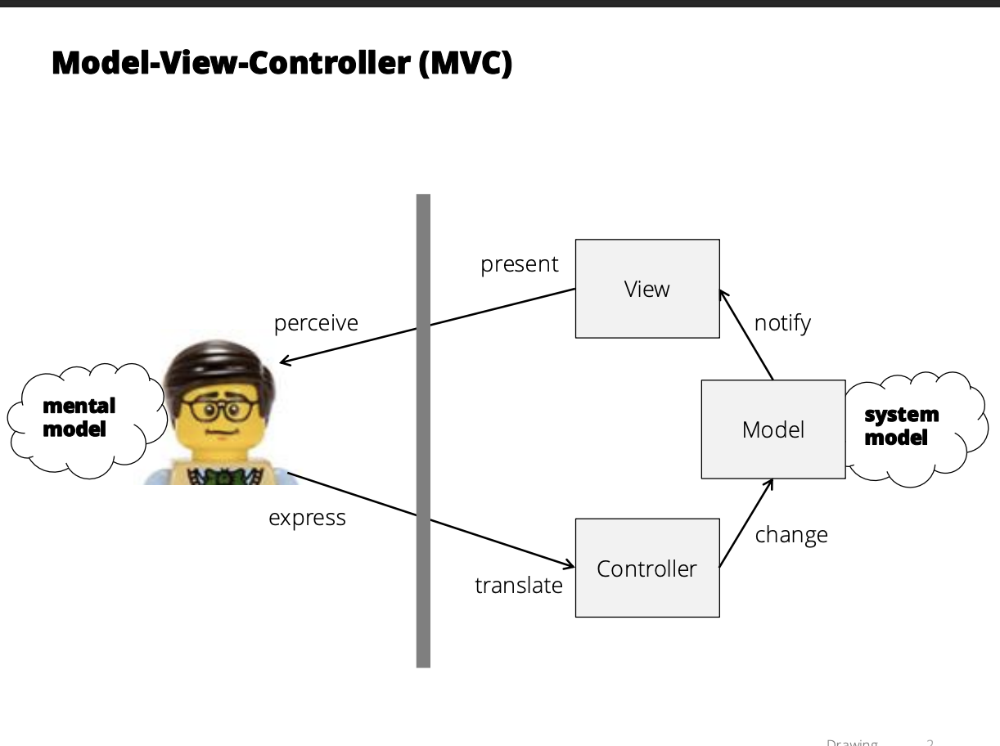

## Intro

- User Interface : The human's view of a computer
- Formally: The place where a person expresses intention to an artifact, and the artifact presents feedback to the person.
- A **mental model** is the *user’s understanding of how a system works* based on their experience and expectations.
    - **Importance:** If the mental model matches reality → fewer errors. If not → confusion.
    - **Example:** User thinks “Save” automatically uploads to the cloud, but in reality it only saves locally.

**User Interface** vs. **User Interaction**

- Interface refers to the external presentation to the user
    - Controls (what user manipulates to communicate intent)
    - Feedback (what the program uses to communicate its response)
- Interaction refers to actions by user and system over time
    - interaction is a dialog with a cycle alternating between the user
    manipulating controls and the system responding with feedback

**Graphical User Interface**

- We can assume:
    - a pointing device (e.g. mouse)
    - a text entry device (e.g. keyboard)
    - a high-resolution display
- The display contains interactive elements (e.g. widgets)
- Users interact primarily by pointing and clicking
    - pointing at an object of interest (e.g. widget, image, text)
    - clicking to select, drag to move, etc.
- The **advantage** is that it emphasizes recognition over recall of available actions
    - Easier to discover options and experiment
- Uses metaphor and analogy to make interface more intuitive
- However, the disadvantage is that:
    - Consumes valuable screen space, forcing information off-screen
    - Switching between keyboard and pointing device time consuming

## JavaScript

A **closure** occurs when an inner function retains access to the variables of its outer function, even after the outer function has finished executing. This allows the inner function to "remember" the environment in which it was created.

Example:

```jsx
function outer() {
  let count = 0;
  return function inner() { //closure function
    return ++count;
  };
}
const counter = outer();
console.log(counter()); // 1
console.log(counter()); // 2

```

In JavaScript, functions are treated as **first-class citizens**. This means functions can be assigned to variables, passed as arguments to other functions, and returned from functions.

Example:

```jsx
const greet = () => "Hello";
const runFunction = (fn) => fn();
console.log(runFunction(greet)); // "Hello"

```

Equality Operators

`==` (loose equality): Compares two values after converting them to a common type. 

Example: `5 == "5"` → true

`===` (strict equality): Compares two values without type conversion. They must be the same type and value. 

Example: `5 === "5"` → false

Prototype

Every JavaScript object has an internal `[[Prototype]]` object. This is the basis of prototype-based inheritance. One object can inherit properties and methods from another via the prototype chain.

Example:

```jsx
const person = {
  greet: function() {
    return "Hello";
  }
};
const student = Object.create(person);
console.log(student.greet()); // "Hello"

```

**Factory Function**:A function that returns a new object each time it is called. Useful for creating multiple similar objects.

Example:

```jsx
function createUser(name) { //this is a factory function
  return {
    name: name,
    greet: () => `Hi, I'm ${name}`
  };
}
const user1 = createUser("Alice");
const user2 = createUser("Bob");

```

Logical Operators

`""`, `0`, `null`, `undefined`, `false`, `NaN` are **falsy**.

`||` returns the first truthy value. Example: `0 || 5` → `5`

`??` returns the first value that is not null or undefined. Example: `0 ?? 5` → `0`

`?.` optional chaining — allows safe access to deeply nested properties. Example: `user?.profile?.email`

`undefined` means variable is not defined

`null` intentionally set it as no value assigned

The `class` keyword simplifies working with constructor functions and prototypes. It provides cleaner, more familiar syntax for object-oriented development.

Example:

```jsx
class Person {
  constructor(name) {
    this.name = name;
  }
  greet() {
    return `Hi, I'm ${this.name}`;
  }
}

```

**Arrays**

Arrays are iterable objects in JavaScript. You can use loops or higher-order functions like `map`, `filter`, and `reduce` to work with them.

Example:

```jsx
let arr1 = [];
```

**Destructuring** allows you to extract values from objects or arrays into variables. You can also rename them.

Example:

```jsx
let obj = { a: 1, b: 2, c: 3 };
let { a: x, b: y } = obj;
console.log(x); // 1
console.log(y); // 2

```

Explanation: `b: y` means take the value of `b` and assign it to a variable called `y`.

The `map()` function creates a new array by applying a function to each element of the original array.

Example:

```jsx
const arr3 = [1, 2, 3];
const arr4 = arr3.map(x => x * 10);
console.log(arr4); // [10, 20, 30]

```

---

## TypeScript

**What is TypeScript**

**TypeScript** is a superset of JavaScript that adds optional static typing. It catches errors during compile time and improves developer tooling like IntelliSense, code navigation, and auto-completion.

**Type Checking:** TypeScript checks variable types at compile time.

Example:

```tsx
let a = 123;
a = a + "hello"; // Error: string is not assignable to number

```

**Type Annotations:** You can explicitly specify the type of variables using a colon.

```tsx
let n: number;
let s: string;
let b: boolean;

```

**Implicit Types**

TypeScript can detect the type if a value is assigned immediately.

```tsx
let n = 123; // inferred as number
```

If a type cannot be inferred, it becomes `any`, which disables type checking.

Array Types

There are two main ways to declare arrays with specific types:

```tsx
let arr1: number[];
let arr2: Array<number>;

```

You can specify the type for function parameters and the return value.

Example:

```tsx
function add(a: number, b: number): number {
  return a + b;
}

```

You can define reusable type definitions.

Example:

```tsx
type NumberArray = number[];

```

**Interfaces** describe the structure of an object.

Example:

```tsx
interface Point {
  name: string;
}

```

Union types allow a variable to hold multiple types.

Example:

```tsx
let id: number | string;

// most commonly used in function arguements

function printID(id: number | string) {
	console.log(`Your ID is ${id}`);
}

```

This means `id` can either be a number or a strings

TypeScript automatically narrows union types using conditions:

```tsx
function formatId(id: number | string): string {
  if (typeof id === "number") {
    return `${id}`;
  } else {
    return id.toUpperCase();
  }
}
```

TypeScript introduces an enum type:

```tsx
enum State {
	Idle,
	Down,
	Up,
}
let state1: State = State.Idle
```

**Summary**

🧩 **Primitive Types**

---

```tsx
let age: number = 20;
let name: string = "Faiz";
let isActive: boolean = true;
let anything: any = "can be anything"; // ⚠️ avoid if possible
let maybe: unknown = 42;

```

---

🧺 **Arrays**

```tsx
let names: string[] = ["Ali", "Faiz"];
let scores: Array<number> = [90, 85];

```

---

📦 **Objects**

```tsx
let user: { name: string; age: number } = {
  name: "Faiz",
  age: 21
};

```

---

🏷️ **Type Aliases**

```tsx
type Point = { x: number; y: number };
let p: Point = { x: 5, y: 10 };

```

---

🔀 **Union Types**

```tsx
type ID = number | string;
let userId: ID = 123;
userId = "abc";

```

---

🎯 **Literal Types**

```tsx
type Status = "success" | "error" | "loading";
let s: Status = "success";

```

---

🛠️ **Functions**

```tsx
function add(a: number, b: number): number {
  return a + b;
}

function greet(name: string = "Guest") {
  console.log("Hello, " + name);
}

```

---

🧱 **Interfaces**

```tsx
interface Car {
  make: string;
  model: string;
  year: number;
}

const car: Car = {
  make: "Toyota",
  model: "Camry",
  year: 2022
};

```

---

📉 **Type Narrowing**

```tsx
function printId(id: number | string) {
  if (typeof id === "string") {
    console.log(id.toUpperCase());
  } else {
    console.log(id);
  }
}

```

---

🔗 **Tuples**

```tsx
let pair: [string, number] = ["score", 100];

```

---

🚫 **Common Mistakes to Avoid**

- Using `any` everywhere → prefer `unknown` or strict types
- Forgetting return types in functions
- Accessing union types without narrowing (use `typeof`, `in`, etc.)

---

💡 **Tips**

- TypeScript only exists at **compile time**, not runtime
- Use `as` for type assertions, but don’t overuse:
    
    ```tsx
    const input = document.getElementById("myDiv") as HTMLDivElement;
    
    ```
    

---

## Drawing



mvc

The **windowing system** is an operating system layer to share screen space and user input among applications

it provides three man services

1. manage list of windows: creating, resizing, focusing, etc
2. provide each application with an independent drawing area
3. dispatch low level input events to the focused window 

a **modern web browser** is like a windowing system where it manages a list of tabs, provides each tab with an independent drawing area, etc


**Drawing Primitives**


HTML canvas (HTMLCanvasElement) is a literal “canvas abstraction”

- can create with a `<canvas>` tag

import startsimpleKit, setSKDrawCallback and start it up via `startSimpleKit()`and then set the drawing callback

```tsx
setSKDrawCallback((gc) => {
  gc.fillRect(10, 10, 50, 50);
});
// is a function that tells the system how to draw
//everything on the screen EACH FRAME

```


`save()` to push the current drawing state to stack

`store()` to pop last saved drawing state and restore it

A **display list** is a list of *what* to draw (not actual pixels). It stores objects (like rectangles or circles), and you redraw them each frame. It avoids re-rendering everything manually. (basically: *a list of drawable objects in order to be rendered*)

```tsx
//first circle before saving state
gc.fillStyle = "blue";
gc.strokeStyle = "red";
gc.lineWidth = 5;
circle(50,50); 

gc.save();

//second circle before saving state
gc.fillStyle = "yellow";
gc.strokeStyle = "black"
gc.lineWidth = 2;
circle(110,50);

gc.restore(); //restorign state to the first cicle

circle(170,50);
```


Instead of writing all drawing code manually every time, we **create reusable objects** that know how to draw themselves.

1. **Define a Drawable Interface**

```tsx
export interface Drawable {
  draw: (gc: CanvasRenderingContext2D) => void;
}

```

> This means any object that implements this interface must have a .draw() method.
> 
1. **Make a Drawable Class**

```tsx
export class MyShape implements Drawable {
  draw(gc: CanvasRenderingContext2D) {
    // put drawing commands here (like fillRect, stroke, etc.)
  }
}

```

> You can now define any shape or UI element inside a class.
> 
1. **Use the Object to Draw**

```tsx
const myShape = new MyShape(...);
myShape.draw(gc);

```

> The shape takes care of its own drawing using the graphics context (gc).
> 
- Keeps drawing code **organized and reusable**
- Helps build **complex scenes** from smaller objects
- Works well with **display lists** and **animations**

Painter’s Algorithm

- Basic graphics primitives are (really) primitive.
- To draw more complex shapes:
    - Combine primitives
    - Draw back-to-front, layering the image
    - Called *“Painter’s Algorithm”*

## Input Events

**Event-Driven programming** is a programming paradigm that bases program execution flow on events. These can represent user actions or other system actions. 

**Fundamental Events:** raw events directly from the browser

**Translated Events:** higher-level processed events derived from fundamentals

Types of Event Devices:

- Device Input Events (keyboard, pointing via mouse)
- Window Input Events (changes via resizing and closing)
- Window or Widget Events (pointing, focus)
- system events (timer)
- application events (thread like progress, completed)

Purpose of Event Queue in SimpleKit run loop: stores input events so they can be processed in order during each animation frame, ensuring smooth UI updates

The transformed low level input is a *state* 

- each keyboard key is either *up* or *down*
- each mouse button is either *up* or *down*

the windowing system generates **events when the state changes:**

- *keydown* when a key state changes from “up” to “down”
- *keyup* when a key state changes from “down” to “up”
- *mousemove* when X/Y value changes
- *mouseup/mousedown* when button changes start from *up/down* to *down/up* (tracks the cursor) fires immediately when the mouse button is pressed up/down

key differences between keydown and mousemove is that 

- keydown is an event that fires once when a key on the keyboard is pressed down
- mousemove fires everytime the mouse moves slightly so it would be every small movement of the cursor

```tsx
setSKDrawCallback() 
//sets the function that gets 
//called on every drame to draw your objects
//it does not draw directly, it tells SimpleKit: 
//"here's how to draw everything when it's time"
```

| Aspect | `keydown` | `mousemove` |
| --- | --- | --- |
| Triggered by | Keyboard key press | Mouse movement |
| Frequency | Once (or repeated if held) | Continuously while mouse moves |
| Used for | Commands, controls, toggles | Tracking cursor, live drawing |
| Data accessed | `e.key` | `e.x`, `e.y` |
| Common combo | `keydown` + `keyup` for control | `mousemove` + `mousedown` for drag |

each event is associated with a timestamp

**event queue** is a buffer between the user and each window. user input events tend to be *bursty*

> createWindowSystem
> 
- creates a shared fundamental event queue

```tsx
const eventQueue: FundamentalEvent [] = [];
```


## **Hit Testing**

**Hit-Testing** is the process of checking whether a user’s mouse or touch input interacts with a visual element (shape) on the screen. It’s used for detecting clicks, dragging, hovering, etc.

**Shape Model vs. Shape Image**

- **Shape Model**: The internal structure — includes geometry (x, y, radius, width, height), stroke, fill, transformations.
- **Rendering**: Turns the shape model into a visual image using the graphics context.
- **Shape Image**: The actual pixels drawn on the screen (what the user sees).


**Common Shape Representations**

- **Rectangle**: top-left `(x, y)`, width `w`, height `h`
- **Circle**: center `(x, y)`, radius `r`
- **Polygon**: array of corner points `[(x0, y0), (x1, y1), ...]`
- **Polyline**: like polygon, but not closed — path of lines
- **Line**: from `(x1, y1)` to `(x2, y2)`

**Hit Test Paradigms**

- **Inside Hit-Test**: Checks whether the cursor is inside the **filled** area of a shape.
- **Edge Hit-Test**: Checks whether the cursor is on the **stroke** (border) of a shape.

Examples:

```tsx
// Circle Inside Hit-Test
(dx * dx + dy * dy) <= r * r

// Rectangle Inside Hit-Test
mx >= x && mx <= x + w &&
my >= y && my <= y + h

// Circle Edge Hit-Test
const dist = sqrt(dx*dx + dy*dy);
r - s/2 <= dist && dist <= r + s/2

```

**Hit-Testing Considerations**

- Hit-testing uses the **mouse's coordinates** (or touch coordinates) and checks against the geometry of shapes.
- You typically add a `hitTest(mx, my)` method to each shape class.
- For complex shapes like polygons, `isPointInPath()` from the Canvas API can be used.

**Optimizing Hit-Testing**

- Hit testing can become expensive when there are many shapes on screen or when shapes are complex.
- Strategies:
    - **Avoid square roots** (use squared distances)
    - **Early rejection** using bounding box check
    - **Spatial partitioning** (split scene into grid cells or use a quadtree)
        - helps limit hit tests to only shapes within a **specific region**
    - Only hit-test **visible** or **interactive** shapes

**Canvas API Support**

- `gc.isPointInPath(mx, my)`: Checks if a point is inside a path.
- `gc.isPointInStroke(mx, my)`: Checks if a point is on the border (stroke).

**Hit-Testing in Practice**

- Used for:
    - Selecting or clicking shapes
    - Drag-and-drop behavior
    - Hover effects (e.g., tooltips)
    - UI widgets (buttons, sliders, etc.)
- Each shape can implement its own logic depending on how it should react to input.

## Animation

**Animation:** is the simulation of motion through a sequence of images or drawings that change over time.

**Frames and Frame Rate**

- **Frame:** A single still image in an animation sequence.
- **Frame Rate:** How many frames are shown per second (measured in FPS or Hz).
    - Film: ~24 FPS
    - Games/UI: ~60 FPS
    - VR: 90+ FPS
- Higher frame rates = smoother animations. (the higher the better)

| Term | What it means |
| --- | --- |
| **Frame** | One single image or moment in an animation |
| **Frame Rate** | How many frames are shown per second (e.g., 60 fps = 60 Hz) |
| **Tweening** | Interpolating (filling in) frames between two "key frames" |
| **Key Frame** | A frame that marks a major change (e.g. start or end of motion) |
| **Easing** | A function that controls how the speed/feel of tweening changes |

**Simulation**

Animating by simulation means using rules and functions to update the state every frame (no start/end, it just loops). For example:

```
dot.x += dx;
dot.y += dy;

```

If it hits the edge, reverse direction:

```tsx
if (dot.x < dot.r || dot.x > box.width - dot.r) dx *= -1;

```

**Timers**

Timers control *when* an animation or event should happen.

- Needs: `duration`, `startTime`, `update` logic, and optional `callback`.
- Use `skTime` or current time from animation callback to manage timers.
- Example: Turn something blue for 2 seconds after a click.

**Tweening (Interpolation)**

Tweening creates smooth transitions between two values.

- Interpolates between a `startValue` and `endValue` over a `duration`.
- Uses a linear interpolation formula:

```tsx
// linear interpolation from start to end
// using normalized time t (in [0,1])
const lerp = (start, end, t) => start + (end - start) * t;

```

Where `t` is `(currentTime - startTime) / duration`.

**Easing Functions**

Easing changes the *feel* of an animation (makes it less linear).


- Example functions:
    - `easeOut = (t) => t*t`
    - `flip = (t) => 1 - t`
    - `easeIn = flip(easeOut(flip(t)))`
- Use:

```
value = lerp(startValue, endValue, easing(t));

```

---

**Keyframes**

- A tween is between 2 keyframes.
- Keyframing uses a sequence:

```
[
  { time: 0, value: 100 },
  { time: 1000, value: 300 },
  ...
]

```

- Find two keyframes for current time and interpolate.

---

**Animation in SimpleKit**

Use `setSKAnimationCallback((time) => { ... })` to animate each frame.

Use it to update positions, change colors, and control timing.

---

**Animator Class in SimpleKit**

```
export class Animator {
  constructor(
    public startValue: number,
    public endValue: number,
    public duration: number,
    public updateValue: (v: number) => void,
    public easing: EasingFunction = (t) => t
  ) {}
}
```

Call `update(time)` every frame to animate and interpolate value.

**Animation Manager Pattern**

An animation manager holds multiple animations and updates them all each frame:

```
manager.update(currentTime);

```

Removes finished ones automatically.

**System Timers and UI Threading**

- UI toolkits usually run in a **single-threaded** environment.
- Animation callbacks (`setInterval`, `requestAnimationFrame`) must run on the UI thread.
- Don't update the UI from another thread directly—can cause bugs or exceptions.

**Example Use Case**

- If square is clicked → turns blue for 2s (using timer).
- If click is outside → square moves to the click location over 1s (using tweening).

## Widgets

- UI widget is a generic name for parts of an interface with their own behaviour, also called *components* or *controls* or *elements* or *views*
- **Widgets** is a reusable UI element with its own behaviour and visual representation


**Widget Functions**

- display information like a MVC View
    - convert current state, e.g of data, of action
- handle user input like a MVC controller
    - capture user input and generate events


**Widget Types**

- **Abstract Widget** describes a widget based on function, not appearance

| **Abstract Widget** | **What it Does** | **Examples** |
| --- | --- | --- |
| **Action** | Triggers an action | `Button`, `Menu` |
| **Number** | Input or show a number | `Slider`, `Spinner` |
| **Boolean** | Toggle true/false | `Checkbox`, `Toggle` |
| **Choice** | Pick from a list | `Dropdown`, `Radio Group` |
| **Text** | Show/edit text | `Label`, `TextField` |
| **Container** | Holds other widgets | `Panel`, `Tabs` |

```tsx
//widget example: button
class SKButton extends SKElement {
  draw(gc) { //draw() shows how it looks
    if (this.isHovered) { //if the mouse hovers over, turn it into light blue
      gc.fillStyle = "lightblue";
    } else {
      gc.fillStyle = "white";
    }
    gc.fillRect(this.x, this.y, this.width, this.height);
    gc.fillText(this.label, this.x + 10, this.y + 20);
  }

  onClick() { // triggers when clicked and emits an action
    this.sendEvent("action");
  }
}
//Widget Example: Label
//Just displays text — no interaction.

class SKLabel extends SKElement {
  draw(gc) {
    gc.fillText(this.text, this.x, this.y);
  }
}

//Widget Example: Checkbox (Boolean Abstract Widget)

class SKCheckbox extends SKElement {
  constructor(props) {
    super(props);
    this.checked = false;
  }

  draw(gc) {
  
    gc.strokeRect(this.x, this.y, 20, 20);
    if (this.checked) {
      gc.beginPath();
      gc.moveTo(this.x + 4, this.y + 10);
      gc.lineTo(this.x + 10, this.y + 16);
      gc.lineTo(this.x + 16, this.y + 4);
      gc.stroke();
    }
  }

  onClick() {
    this.checked = !this.checked;
    this.sendEvent("value changed");
  }
}

//container widgets where it hold widgets and lay them out.
// think of it like a parent <div> in HTML

class SKPanel extends SKContainer {
  constructor(props) {
    super(props);
    this.children = [];
  }

  addChild(widget) {
    this.children.push(widget);
  }

  draw(gc) {
    for (const child of this.children) {
      child.draw(gc);
    }
  }
}

//widgets can use a shared Style class, can treak fonts, colors, etc
const Style = {
  widgetHeight: 30,
  font: "14px sans-serif",
  color: "blue",
};

```

## Dispatch

**Dispatch** refers to the routing of an event to the appropriate **widget** or **code** that needs to handle it. Dispatch takes care of who was clicked (which widget) and how should it handle (what function to call) by finding the right widget based on mouse position or focus and sending the event to that widget so it can react

In UI Architecture: to route an event to the appropriate widget/code

**UI Event Flow (Pipeline)**

The event moves through the following stages:

1. **Low-Level Input** (OS/device)
2. **Event Creation** (Toolkit layer)
3. **Event Queue** (Queued in browser)
4. **Dispatch** (Toolkit routes it to widgets)
5. **App Binding** (Your code handles the event)

**View Hierarchy**

- UI elements are structured as a **tree** with one root.
- Containers group child widgets; child order = draw order.
- **Overlapping** elements require careful dispatching.


```tsx
const blueContainer = new SKContainer({ fill: "lightblue" });
const greenContainer = new SKContainer({ fill: "lightgreen" });
const buttonA = new SKButton();
const buttonB = new SKButton();

blueContainer.addChild(buttonB);
blueContainer.addChild(greenContainer);
greenContainer.addChild(buttonA);

```


**Dispatch Steps (uses DFS)**

1. **Target Selection**
    
    Find which widget is under the mouse or has focus (positional vs focus).
    
2. **Route Construction**
    
    Build a path from the **root to the target** widget.
    
    builds a list of widgets from the **root of the widget tree** to the **target widget**. It includes all **ancestors** of the target and is used during event propagation (capture and bubble phases).
    
3. **Propagation**
    
    Two phases:
    
    - **Capture (DOWN)**: From root to target
    - **Bubble (UP)**: From target back to root

```
function dispatch(me: SKMouseEvent, root: SKElement) {
  const route = buildTargetRoute(me.x, me.y, root);

  const stopPropagation = route.some((el) => el.handleMouseEventCapture(me));
  if (stopPropagation) return;

  route.reverse().some((el) => el.handleMouseEvent(me));
}

```

**2 Main Type of Dispatch:**

- **Positional Dispatch**: Widget under the mouse (e.g. buttons).
- **Focus Dispatch**: Widget with current focus (e.g. textfields for keyboard input).

**Event Binding Mechanisms**

Global Event Callback (Old Windows)

A single function like `WindowProc` handles all events.

A widget uses `stopPropagation()` when it wants to handle an event **without letting other widgets (like its parents) also react**. This is useful when, for example, a button inside a list item is clicked — you want the button to perform its action, but **stop the event from reaching the list**, so the list doesn't also think the item was selected.

```cpp
switch (uMsg) {
  case WM_KEYDOWN:
    // handle key
    break;
}

```

Inheritance Binding

Widgets extend a base class with generic handlers like:

```
onMouse(e), onKeyboard(e), onMouseClick(e)

```

Listener Binding (JavaFX Style)

```java
textField.setOnKeyPressed(event -> {
  if (event.getCode() == KeyCode.ENTER) { ... }
});

```

**SimpleKit Binding (Used in Course)**

```
button.addEventListener("click", (e) => {
  console.log("Button clicked!");
});

```

- Handlers are stored in a binding table:

```
this.bindingTable.push({ type: "click", handler });

```

**2 Phases of Event Propagaton: Capture vs Bubble**

- **Capture Phase**: Goes from root to target (DOWN)
- **Bubble Phase**: Returns from target to root (UP)
- Handlers can stop propagation by returning `true`
- Having both gives flexibility: one phase can pre-process or block, the other can respond or clean up.

**Mouse Enter / Exit Events**

Widgets can receive hover-like events:

- **mouseenter**: mouse enters widget bounds
- **mouseexit**: mouse leaves widget bounds

Used for hover effects.

**Focus Management**

- Only **one widget** can have keyboard or mouse focus.
- **Mouse click** gives mouse focus.
- **TAB key** gives keyboard focus.

**Example: Add Two Numbers App**

Widgets:

- Two SKTextfields
- One "+" SKButton
- One SKLabel for output

```tsx
plusButton.addEventListener("click", (e) => {
  const val1 = parseInt(input1.getText()) || 0;
  const val2 = parseInt(input2.getText()) || 0;
  resultLabel.setText("= " + (val1 + val2));
});

```

## Layout

- a visual arrangement of widgets in a user interface
- the way widgets are arranged in the interface (how buttons, text fields, containers, etc are positioned and sized on the screen

**Box Model:**

- UI elements typically use a hierarchy of dimensions for size
- 4 dimensions are:
    - **margin**: “outside” space away from the other elements
    - **border**: thickness of stroke outlining element
    - **padding**: inside space between the border and the content
    - **content**: the actual content of the element
    - in SimpleKit, there is no border but we use alternative box model: width = content + padding

**Widget Sizes:**

- **Content Size**: The size of the widget’s main content
- **Intrinsic Size:** content + padding + margin
- **layout size**: how much space it can actually take

**SimpleKit Box Model Implementation**

- SKElement:
    - **measure:** calculates intrinsic size using boxmodel
    - **layout** sets element size (intrinsic size or specific size)
- SKContainer
    - **measure:** calculates intrinsic size with or without children
    - **layout** sets element size (with or without children)

**2 Types of Layout (Two Pass Layout)**

1. **Measure** – All widgets calculate their *intrinsic size*.
2. **Layout** – All widgets are *positioned and sized* based on layout strategy.

```tsx
function layoutRoot() {
  uiTreeRoot.measure(); // Step 1: Measure intrinsic sizes
  uiTreeRoot.layout(gc.canvas.width, gc.canvas.height); // Step 2: Apply positions/sizes
}

```

`fillWidth` and `fillHeight` are properties that tell the layout system to stretch the widget to fill the available space horizontally and vertically inside the container. 

**Layout Implementations**

FixedLayout

Widgets manually set their `x`, `y`, `width`, `height`.

```
root.layoutMethod = new Layout.FixedLayout();

```

CentredLayout

All widgets stack on top of each other, centered in the parent container.

```
root.layoutMethod = new Layout.CentredLayout();

```

WrapRowLayout

Widgets are placed in rows, wrapping when space runs out.

```
root.layoutMethod = new Layout.WrapRowLayout({ gap: 10 });

```

FillRowLayout

Widgets are resized proportionally to fill the container row.

```
root.layoutMethod = new Layout.FillRowLayout({ gap: 10 });
widget.fillWidth = 1; // Proportional size

```

**Layout Invalidation**

When any size/layout property changes, layout needs to be redone.

To prevent multiple recalculations per frame, SimpleKit uses a flag:

```
let layoutRequested = false;
function invalidateLayout() {
  layoutRequested = true;
}

```

Only one layout update runs per animation frame.

## Model View Controller (MVC)

- became a standard design pattern for GUIs
- used at many levels like overall application design and individual components
- was the first MV* interactive system architectures


- why do we use it?
1. Separate data, state, and "business logic" from user-interface
    - Ideally, View and Controller implementations can change without
    changing Model implementation, e.g.:
    - Add support for a new interface (e.g. different device)
    - Add support for a new input device (e.g., touchscreen)
2. Supports multiple views of same data, e.g.
    - View numeric data as a table, a line graph, a pie chart, …
    - Present simultaneous “overview” and “detail” views
    - Distinct “edit” and “preview” views
3. Separation of concerns in code
    - code reuse
    - unit testing

**MVC Implementation**

Interface architecture decomposed into three parts:

- model: manages application data and logic
- view: manages interface to present data
- controller: manages interaction to modify data


1. **Model** stores the data and has logic to update it
2. When the Model changes, it **notifies** Views (via Observer pattern)
3. **View** then refreshes its display
4. **Controller** translates user input into model updates

**Basic Code Architecture**

Model

```tsx
export class Model extends Subject {
  private _count = 0;

  get count() { return this._count; }

  increment() {
    this._count++;
    this.notifyObservers();
  }
}

```

View

```tsx
export class LeftView extends SKContainer implements Observer {
  update(): void {
    this.button.text = `${this.model.count}`;
  }

  button: SKButton = new SKButton({ text: "?" });

  constructor(private model: Model, controller: LeftController) {
    super();
    this.addChild(this.button);

    this.button.addEventListener("action", () => {
      controller.handleButtonPress();
    });

    this.model.addObserver(this);
  }
}

```

Controller

```tsx
export class LeftController {
  constructor(private model: Model) {}

  handleButtonPress() {
    this.model.increment();
  }
}

```

**MVC Variants**

1. **MVA (Model-View-Adaptor)**
    - Adaptor helps View interpret the Model.
2. **MVP (Model-View-Presenter)**
    - Presenter formats data from Model and handles inputs.
    - View & Presenter are tightly connected.
3. **MVVM (Model-View-ViewModel)**
    - Uses **data-binding** so View ↔ Model updates are automatic.

## HTML CSS

- **H**yper**T**ext **M**arkup Language
    - Structure-focused language: describes *what* elements are on the page, not *how* they look.
    - Elements are represented as *tags* like `<div>`, `<span>`, `<p>`, `<h1>`, etc.
    - HTML documents form a tree structure called the DOM (Document Object Model).
- declarative syntax

```html

<div>: block-level element used as a container.

<span>: inline container, used for styling small pieces of text.

<button>, <input>, <form>: interactive form elements.

<script>: loads JavaScript into the HTML page.

```

**DOM (Document Object Model)**

- Browser converts HTML into a **DOM tree**.
- You can access or modify the DOM using JavaScript:
    
    ```html
    const title = document.querySelector("h1");
    title.textContent = "Updated Title";
    ```
    

 **CSS (Cascading Style Sheets)**

- Used for **styling HTML** – color, spacing, layout, fonts, etc.

**CSS Rules**

- has three parts to it:
    - selector
    - declaration block
    - 1+ properties with values


**CSS Selectors**

| Selector | Description | Example |
| --- | --- | --- |
| Tag | Targets all elements of that type | `div {}` |
| Class | Targets elements with a class | `.box {}` |
| ID | Targets an element with a specific ID | `#header {}` |
| Attribute | select elements matching attribute value | `[type="text"] {}` |
| Pseudo | Targets based on state | `button:hover {}` |

**Style Example**

```css
.red {
  background-color: red;
  color: white;
}
#main-title {
  font-size: 2rem;
}

```

**Flexbox (Flexible Box Layout)**

- Used to design **responsive layouts**.
- Parent container:
    
    ```css
    display: flex;
    justify-content: space-between;
    align-items: center;
    
    ```
    
- Axes:
    - **Main axis**: direction of items (default: row)
    - **Cross axis**: perpendicular to main

**Styling with Classes vs IDs**

- **Classes** (`.box`): reusable styling for multiple elements.
- **IDs** (`#header`): unique styles for one element only.
- IDs have **higher specificity** in CSS.
- A **class** applies a style to multiple elements, while an ID targets one specific element. Classes use `.` in css `.box` and IDs use `#`(`#main)` . Use classes for reusable styles, and IDs for one time identifiers like a navbar

**Inline vs Internal vs External CSS**

- **Inline**: style attribute in tag (`<div style="color:red">`)
- **Internal**: in `<style>` tag inside `<head>`
- **External**: in `.css` files (preferred for large projects)

**Declarative vs Imperative**

- **Declarative (HTML/CSS)**: describe what UI should look like.
- **Imperative (JavaScript)**: describe step-by-step how to change the UI.

## **Visual Design**

Visual design focuses on how your UI looks and feels. It helps users navigate interfaces more easily and enjoy the experience.

**Design Goals**

- **Usability**: Easy and intuitive to use
- **Efficiency**: Reduces user effort and thinking
- **Clarity**: Clean layout with clear functionality
- **Aesthetic**: Visually appealing design
- **Accessibility**: Usable for people with different needs

**Core Principles of Visual Design**

- **Visual Hierarchy:** Directs user attention to the most important parts using size, color, alignment, and spacing.
- **Alignment:** Elements should line up with each other or with a grid. This keeps the layout tidy and organized.
- **Proximity:** Related items should be placed close together. Helps users understand which elements belong together.
- **Contrast:** Using strong differences (like bold text or color) to highlight or emphasize important parts.
- **Repetition:** Repeating styles like fonts or button shapes helps make the interface feel consistent and easier to learn.
- **Balance:** Visually distributes elements so the layout doesn’t feel heavy on one side. This can be symmetrical or asymmetrical.
- **White Space:** Empty space between or around elements. It improves focus, readability, and prevents a cluttered look.

**Typography Tips**

- Use 1 or 2 font families
- Use font size to create structure (headings vs body)
- Adjust spacing and line-height for better legibility

**Color Use**

- Pick a small color palette (3–4 key colors)
- Use color intentionally (e.g., to show status or draw attention)
- Make sure there’s enough contrast between text and background
- Use tools like Adobe Color or Coolors for accessible palettes

**Icons and Imagery**

- Use simple, recognizable icons
- Icons should match in style and size
- Avoid random decorative images without meaning
- Always pair icons with text if clarity is needed

**Grid Systems**

- Use columns and consistent spacing
- Helps with alignment and scaling across screen sizes
- Common choice: 12-column grid layout
- uses `@media` query to change grid layout (mobile responsivness)

**Accessibility Considerations**

- Ensure high contrast between text and background
- Let users resize text
- Avoid using color alone to indicate state
- Add alternative text to images for screen readers

**Typeface vs Font**

- Typeface = style of text design
- Font = specific implementation of a typeface

A **Design System** is a systematic approach to product development, complete with guidelines, principles, philosophies, and code

**Primary Colors:** main brand/interface, usually detailed in the layout, key elements, text, etc

**Secondary Colors:** used for functional meaning such as alert

## Text

**Text Representation and Encoding**

Text is not stored as characters but as numbers. These numbers are known as code points.

- **ASCII**: An early standard using 7 bits, representing 128 characters. Only supports English.
- **Unicode**: A modern character set supporting most global languages. Each character has a unique number (code point).
- **UTF-8**: The most common encoding on the web. It’s backward-compatible with ASCII and uses 1 to 4 bytes per character depending on the symbol.

**Internationalization (i18n) vs Localization (l10n)**

- **i18n (Internationalization)**: Designing software in a way that allows it to be easily adapted for various regions and languages. It's about enabling flexibility.
- **l10n (Localization)**: Actually translating and adjusting the content for a specific locale, such as language, date formats, currency, etc.

**HTML Forms**

- : Wraps input elements.
- : Lets users enter text or other data.
- : Describes the input field.
- : Submits or triggers an action.

**Input Attributes:**

- `type`: Sets the kind of data expected (e.g., "text", "email", "password")
- `placeholder`: Shows a hint inside the input
- `required`: Prevents submission if the field is empty
- `maxlength`: Limits number of characters
- `pattern`: Validates input against a regular expression

**Client-Side Validation**

Handled in the browser before the form is submitted. Helps prevent incorrect or missing data from reaching the server.

**Types of Validation:**

1. **Built-in HTML Validation**
    - Example:
        
        ```html
        <input type="email" required>
        ```
        
2. **JavaScript Validation**
    - Example:
        
        ```jsx
        if (!email.includes("@")) {
          alert("Please enter a valid email");
        }
        ```
        
3. **Constraint Validation API**
    - Provides programmatic access to validation rules.
    - Example:
        
        ```jsx
        if (!input.validity.valid) {
          showError();
        }
        
        ```
        

**Input Formatting vs Input Masking**

- **Formatting**: Adjusts the input after it’s entered. Example: showing (519) 555-1234 after submitting a plain number.
- **Masking**: Adds format as the user types. Example: formatting credit card or phone numbers on the fly.

**Why It Matters:** Both help improve readability and user experience while reducing errors.

**Input Sanitization**

Users can input harmful data. If not sanitized, this can lead to:

- Cross-site scripting (XSS)
- SQL injection
- Application crashes or corrupted databases

**Sanitize both client-side and server-side:**

- Client-side sanitization improves usability.
- Server-side sanitization protects the system.

## Undo

4 Design Choices:

- Undoable Actions
    - some actions may be omitted from undo
    - some actions are destructive and not easy undone
    - destructive actions may need confirmation
- State Restoration
    - what will the UI look like after an undo or redo?
    - UI State should be meaningful after redo action
- Granularity
    - how much should be undone at one time
    - how big each undo step is (**chunk)**
        - one chunk = one logical change
- Scope
    - is undo global or for a specific part?

Implementation Approaches:

- **Forward Undo**
    - start from base state and list of changes
    - to undo, skip the last change when rebuilding
    - **Disadvantage:** Can use a lot of memory if storing full state for each step, especially for large documents or images.
- **Reverse Undo**
    - Apply change immediately and store the reverse change.
    - To undo: apply the reverse change.
    - would be good to implement if dealing with destructive actions
    - **Redo invalidation:** After a sequence of undos, what user action **kills the redo stack**, and why is that the right behavior?
        - **Rule:** Any *new* user action after an undo clears the redo stack.
        - **Why:** Redo history only makes sense if you continue along the same branch of changes; a new edit creates a new branch, so the old redo chain is no longer valid.

**Implementation with Stacks**

Using either of these options requires two stacks

- **Undo stack**: all change records, saved as you perform actions
- **Redo stack**: change records that have been "undone" (needed to reapply them with redo)

**Memento**

- simple example of undo
- essentially saves the snapshots of states so it would essentially be the screenshots or something
- the downside is that it uses more memory but it is simple approach

## Direct Manipulation

- virtual representation of an object that is manipulated in a similar way to a real-world object
- make the interaction feel like manipulating a ‘real object’ instead of working through an intermediary
- requires a representation of ‘task objects’ (something a user can manipulate)

| Real World | Interface |
| --- | --- |
| Move hand to object | Move pointer to object |
| Pick up with hand | Click and hold |
| Carry to trash bin | Drag to trash icon |
| Release | Release mouse button |

Benefits:

- feels like you are interacting with objects, not a computer
- focus stays on **task** not on figuring out the interface
- gives a sense of control and engagement

**Dragging**


- mousedown on shape starts draft, calculate *offset* from position to the shape frame-of-reference
- mousemove to drag
- mouseup to end drag

**Transformable Shape:**

- direct manipulation widgets to transform an object:
    - scale by dragging corners and side handles
    - rotate by dragging the rotation handle
    - translate by dragging shape

## Instrumental-Interaction

- a model of interaction based on how we naturally use tools or instruments to manipulate objects in the physical world
    - interfaces have interaction instruments and domain objects

**3 Properties to describing instruments**

- **Degree of Indirection**
    - two dimensional measure of ‘distance’ from instrument to object
    - spatial dimension
        - *near:* drag to translate, handle to resize
        - *medium:* scrollbar near page
        - *far:* dialog box
    - temporal dimension
        - *short:* direct drag response like drag shape
        - *med*: activate tool in toolbar, start direct manipulation
        - *long:* using dialog, full drag-and-drop operation


- **Degree of Integration**
    - ratio of degree of freedom of the instrument over the DOF captured by input device
    
    
    
- **Degree of Compatibility**
    - Similarity of physical actions on instrument and response of the object
    - more similar is better since it’s more natural or intuitive


| Feature | **Direct Manipulation** | **Instrumental Interaction** |
| --- | --- | --- |
| **Interaction Style** | Directly interact with the object itself | Use a separate tool (instrument) to act on the object |
| **Pros** | - Feels intuitive and natural- Immediate feedback- Easy to learn | - More flexible and powerful- Reusable instruments- Supports complex actions |
| **Cons** | - Limited to simple tasks- Can clutter the UI- Not reusable | - Higher learning curve- More indirect- Visual/tool complexity |
| **Example** | Dragging a shape to move it | Using a slider to resize an object |
| **Best For** | Simple, direct interactions | Advanced, multi-step, or customizable interactions |

**Summary:**

- **Domain Object**:
    
    The **thing you want to change**, like a shape on a canvas or a file in a folder.
    
- **Instrument Object**:
    
    The **tool you use** to change the domain object (e.g., mouse, slider, toolbar button). Think of it like using a paintbrush instead of painting with your hands.
    
- **Indirection**:
    
    How **far the tool is** from the object:
    
    - Low = dragging/resizing directly
    - Medium = using a scrollbar
    - High = editing with a dialog box
- **Reification**:
    
    Turning a **tool or action into a visible object** so it can be reused (e.g., having a slider for volume control that can be moved, copied, or reset).
    

✅ Pros:

- Better **control and precision**
- Tools can be **reused**
- Good for **complex tasks**

⚠️ Cons:

- Can feel **less direct**
- Slightly more **complex to learn**
- May **use more memory** if not optimized

## Asynchronous

**System performance** measures how fast the system *actually* runs tasks, while

**perceived responsiveness** is how fast the user *feels* the system is responding — even if it’s still processing in the background.

**Event Loop:**  The event loop checks continuously if there are tasks waiting in the task queue or microtask queue and pushes them to the call stack when it's empty. This allows the UI to stay responsive by deferring slow or blocking operations to be handled later.

A **responsive UI** *feels* like it responds in a timely manner 

it is usually accomplished in two ways:

- designing for human perception and expectations
- using asynchronous execution (so the interface is not frozen while something else is happening

**continuous latency**

- minimal time to be affected by a visual stimulus: max is 10ms where continuous input latency should be less than 10ms
- why it matters?
    - even a small delay makes the interaction feel unresponsive
    - the user’s mental model expects the system to respond instanly, like moving a real object
    - examples:
        - low latency (good): in drawing app, stroke appears exactly where  the cursor/pen moves
        - high latency (bad bad): the stroke lags behind, making it harder to draw accurately

**input feedback**

- immediate acknowledgement that the system has recieved and understood the user’s input via visual, auditory or haptic
- it matters becasue user may think their input was missed, double-click etc
- this will set a expectation of what will happen next
- example
    - button highlight when pressed
    - slider updates value while being dragged
- maximum interval between cause-effects: 140 ms
    - eg. time between pressing a button until the feedback changes


**graceful degradation of feedback**

- simplify feedback for high-computation continuous input tasks
    - example is window manager updates window rendering after drag. graphics editor only draws object outlines during manipulation
    
    
    

**busy indicators**

- display busy indicators for operations that take 1s to about 3-4s

**progress bars:**

- display progress bars for operations more than 3-4s
- show work remaining, not work completed
- use human precision not computer precision (bad: 333.5 seconds remaining ; good: about 4 minutes)
- smooth progress rather than erratic burts

**progressive loading**

- use skeleton placeholders when loading takes more than 1s
- user adjusts to a layout which they will see
- loading process seems faster because there is an initial result
- provide user with *some* data while loading rest of data


**asynchronous execution:**

- execute tasks independently from the main program flow(”do more than one thing at once”)
- two main types of asynchronous execution:
    - asynchronous programming
        - **Asynchronous programming** runs tasks without blocking the main thread, but still on a single thread — tasks are queued and run when the thread is free (e.g., JS event loop).
        - singe thread, event driven
        - related concepts in JavaScript and other languages
            - event driven programming
            - promise/future
            - coroutines
            - non-blocking I/O
        - call backs (functions triggered later)
        - async/await → cleaner syntax for working with promises
    - threading
        - manage multiple concurrent threads with shared resources but executing different instructions
        - threads are a way to divide computation, reduce blocking
        - concurrency risks: eg two threads update a variable

**Prediction Strategy:** use idle time to pre-compute or pre-load the next actions that is likely so they happen instantly when requested.

- example is in a search app, while the user is viewing the current search result, start pre-loading the next result in the background so it opens instantly if they click “next”

**Web Worker:**

- kinda like a helper running in the background of your browser
- Definition: a background script in the browseer that runs tasks without blocking the main UI thread, communicating with the main script via messages
- does the heavy work without freezing your main page
- worker cant touch the page directly, can only send messages back and forth to the main script
- can talk to it with `postMessage()` and listen with `onmessage`

| Feature | **Normal Async Execution (Promises, fetch)** | **Web Worker** |
| --- | --- | --- |
| **Threading** | Single-threaded (still runs on the main thread, just delayed until call stack is clear) | Runs in a **separate thread** from the main UI |
| **Purpose** | Non-blocking I/O tasks (network requests, timers) | Offload **heavy computation** so the UI remains responsive |
| **Example** | `fetch()`, `setTimeout()` | Image filtering, parsing large datasets |
| **UI Access** | Can directly update DOM | **Cannot** touch DOM (must send messages back) |
| **Execution Model** | Uses **event loop** + **task/microtask queues** | Runs independently and communicates via **message passing** |

## Declarative

**Imperative Programming**

- describe how to achieve a result
- SimpleKit used an imperative paradigm to build a UI. Manually creates and arranges elements

**Declarative Programming**

- describe what result you want
- HTML is declarative as it describes the final structure of the DOM tree
- goal is still to create a tree of nodes with events but you **describe** the tree instead of building it step by step
- state changes causes full re-renders of the UI (HTML,JSX,HyperScript


**HyperScript**

- language to generate descriptions of UI trees

```html
div { class "container"} 
p "some text"
button "Ok"

//this is equivalent to below

<div class="container">
	<p> some text </p>
	<button>Ok</button>
</div>
```

**Preact**

- render quickly and efficiently
- DOM (document object model) is a lightweight JS object of the UI.
- differences between react and preact is in preact, events use the *browser’s native DOM events*, while React uses its own *synthetic event system*
- preact uses native DOM events
- virtual DOM only updates the changed parts of the real DOM → faster
- effective memory usage
- treats children nodes as native javascript arrays (basically uses an array instead of having children
- uses class instead of className in React
- we use one root node becasue JSX compiles into a tree structure and that tree needs a single top-level element to attach to the DOM
- components are the building blocks of a preact application where they have custom props
- props: data passed from parent to child where child is read-only and can be used for customization
- hooks: functions like `useState`, `useEffect`, `useSignal` and it should only be called at top-level, same order every render, only inside components

```tsx
function MyComponent(props: { msg: string }) { 
//msg:string is a custom prop
return (
	<div class="container">
	  <p>{props.msg}</p>
	  <button>Ok</button>
  </div>
 );
}
const vdom = (
	<div>
		<h1>my component is below here: </h1>
		<MyComponent msg='hi'/>
	</div>
);
```

Component Children: 

- Components can be nested like HTML elements
- Components can have HTML or Component nodes as children
- This enables control over how Virtual DOM elements nested within a component should be rendered
- The Array of children is a special implicit prop

```tsx
function MyCard(props) {
  return <div class="card">{props.children}</div>;
}

<MyCard> //this is a component
  <h2>Title</h2>
  <p>This is some content.</p>
</MyCard>
 ****
```

**Hook:** A special function in Preact/React that adds extra features (like state or side effects) to functional components, and must be called in the same order every render.

## Reactivity

- can be defined as the ‘automatic’ update of the UI due to a change in the application’s state
- The **Virtual DOM** is an **in-memory representation of the real DOM**. Frameworks use it to **batch and minimize real DOM updates**, making UI rendering faster and more efficient because direct DOM manipulation is expensive.
- VDOM Reconciliation
    - save copy of current VDOM
    - components/application state updates the VDOM
    - re-render is triggered by framework
    - compare VDOM *before update* with VDOM *after update*
    - reconcile the difference by identifying a set of DOM patches
    - perform patch operations on real DOM
- if node type changes, the whole subtree is rebuilt


- if node type is the same, attributes are compared and updated


- if a node is inserted into list of same node type siblings, all children will be updated


- When updating children of same node type, use key prop
    - each key must be stable and unique
    - key should be assigned when data created, not when rendered

**Approaches to Managing Application State**

1. **`useState` hook for local component state**
    1. pass state to children
    2. manage state with `useState` hooks
    3. state is stored in root component
    4. passed to children using props

```tsx
function User() {
	const [name,setName] = useState("Bob");
	const [age,setAge] = useState("13");
	const [online,setOnline] = useState(true);
```

1. **`useContext` hook to access state**
    1. without passing as props
    2. Provider wraps components → children use `useContext` to get values.
    3. similar to shared backpack that any component can open and grab data from - no matter where they are in the tree
    4. you put the data in the backpack using a **Provider** at a high level
    5. this is quite similar to themeProvider
    
2. **Signals**
    - From `@preact/signals`.
    - Export signals + mutations from a state module.
    - Minimal, well-organized, used only where needed.
    - Reassign arrays/objects to trigger updates.
    
    **Best Practices for Signals**
    
    - Keep state small and focused.
    - Avoid too many signals (performance).
    - Use `useState` for local state; signals for shared/global.
    - Keep components small and focused.

```
import { signal } from "@preact/signals";

// state
export const count = signal(0);

// mutations
export const increment = () => {
  count.value++;
};

import {signal} from '@preact/signals';
export const count = signal(0);
export const increment = () => {
	count.value++
};
```

## Effects

- code that runs outside the normal VDOM render cycle
- happen after a render when something in state/props changes
- example
    - logging
    - DOM changes
    - adding global event listners
    - fetching data
    - drawing on `<canvas>`
- hooks for side effects:
    - `useEffect`, `useLayoutEffect`, `useMemo`
- how does `useEffect` works?
    - runs **after render**
    - can have dependency array
        - no array → runs after every array:
        - empty `[]` → runs once after mount
        - `[var]` → runs when `var` changes
    - can return cleanup function
- toggle
    - emulates input checkbox
        - `checked` boolean prop with `onChange` Event prop
    - has option `label` string prop for label text
- collapsible
    - `useState` for local component state
    - children prop
    - conditional rendering
    - simple inline styling
    - use `useMemo` hook to create local signal

**Component Data Flow**


## Styling

**Tailwind** is a utility-first CSS framework that styles elements with short class names, supports responsive and state-based styling, and removes unused CSS in production for efficiency—ideal for declarative UI components.

Ways To Style Components

- seperate CSS file for each component
- inline css attributes in component render
- css modules
- utility classes

**Inline CSS**

- style attribute accepts a JavaScript object to specify the CSS properties
- easy for quick styles but limited flexibility such as no selectors, pseudo-classes

```tsx
"padding: 10px" -> { padding:"10px" }
"padding: 10px" -> { padding:"10" } 
//by default, it's translated to px
//JavaScript var names cannot have '-' char so 
//it is in camelCase
"flex-flex: row nowrap" -> {flexFlow: "row nowrap"}
```

**CSS Modules**

css file with `'module.css'` extension

generates unique classname so styles only affect that component

```tsx
import styles from './MyComponent.module.css';
<div className={styles.root}>
```

**Tailwind**

- **utility classes:** short, single-purpose class names that directly apply to a specific style:
    
    ```tsx
    <div class="bg-red-500 text-white p-4 rounded">
      Hello World
    </div>
    //notes:
    `bg-red-500` → background color
    
    `text-white` → text color
    
    `p-4` → padding
    
    `rounded` → border radius
    ```
    
- tailwind avoids conflicts because it uses predefined utility class names not the generic selectors
- bundler removes all unused CSS for production
    - most Tailwind projects ship less than 10kB of CSS to the client
- Approach works best with declarative UI programming
    - e.g. components in Preact
- `@apply` let you use **utility classes** inside your own CSS so you can group styles and avoid repeating class lists in HTML

## Accessibility

Definition: developing content to be as accessible as possible, no matter an individual’s physical and cognitive abilities and how they access a user interface. often abbreviated as `a11y` 

Access to User Interface is considered as *human right*

**Abilities**

- People vary in physical and mental capabilities
    - How are your abilities different from other people?
    - How will your abilities change in the future?
    - How will your abilities change in different environments


**Types of Long-term Impairments**

- **Visual**: blindness, low vision.
- **Hearing**: deafness, partial hearing loss.
- **Motor**: wheelchair use, limited hand dexterity.
- **Cognitive**: memory loss, learning disabilities.
- Aging increases chances of impairment.

**OS Accessibility Features**

- Zoom, screen readers, captions, speech dictation, keyboard cursor control, voice input.

**Enhancements**

- **Visual**: larger text, high contrast, dark mode, remove animations, screen readers.
- **Hearing**: visual alerts, sound recognition, background noise filtering.
- **Motor**: sticky keys, eye tracking, physical switches.
- **Cognitive**: text-to-speech, icons, slower interfaces, reduced animations.

**Curb Cut Effect:** Accessibility features often help everyone (e.g., captions help in noisy areas, learning languages).

**Legal Requirements**

- Canada: Accessible Canada Act (federal), AODA (Ontario) → must follow WCAG (Web Content Accessibility Guidelines) standards.
- US: Section 508, ADA.
- EU: Web Accessibility Directive.

**Four WCAG Principles:**

- **Perceivable** – Information must be presented so users can perceive it. Example: Provide alt text for images.
- **Operable** – Users must be able to interact with the interface. Example: Ensure all controls are usable via keyboard.
- **Understandable** – Content and operation should be clear. Example: Use simple, consistent navigation.
- **Robust** – Content should work with different assistive tech. Example: Use semantic HTML so screen readers can interpret structure.

**Implementing Accessibility**

- **Accessibility Tree**: browser’s version of the DOM for assistive tech.
- **The Accessibility Tree** is a version of the DOM that the browser creates for assistive technologies like screen readers. It contains only the information these tools need, such as roles, names, and states of elements.
- Use **Semantic HTML** (headings, lists, nav, section) instead of just `<div>` and `<span>`.


- Skip Links: let users jump straight to main content.
- **ARIA**: add extra meaning for assistive tech (only if semantic HTML can’t do it).
- **Accessible forms**: proper labels, legends, and fieldsets.
- Colour contrast: WCAG (Website Content Accessibility Guidelines) min = 4.5:1 (text vs background)
    - The WCAG minimum contrast ratio for normal text is **4.5:1**. This ensures that text is readable for users with low vision or in poor lighting conditions.


**Testing**

- Try keyboard-only navigation (Tab, Shift+Tab, Enter, Arrow keys).
- Test with a screen reader.
- Use tools like WAVE and browser DevTools contrast checker.