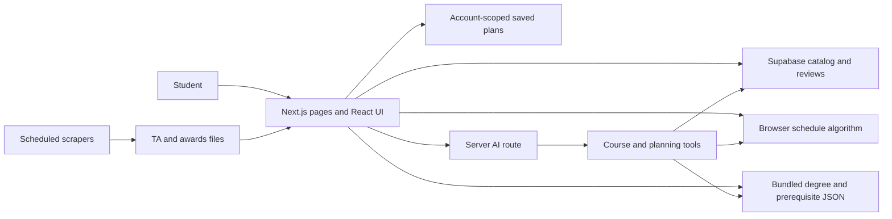

# uoguelph.courses: transferred project knowledge

This note captures the system behind the [portfolio story](../app/%5Bslug%5D/mdx/uoguelphcourses.mdx). Its source is the local `guelph.courses` repository, particularly `docs/project-system-design.md`, `docs/frontend-system-design.md`, `docs/supabase-system-design.md`, and `docs/ai-agent-system-design.md`. Check that repository before updating implementation claims.

## Product and main paths

The site is an independent, student-run University of Guelph planning product. Its current home page links to courses, professors, a schedule builder, degree planner, GPA calculator, course outline search, classrooms, TA positions, and scholarships. The portfolio story concentrates on the connected path from discovering a course to fitting it in a timetable and degree plan.

| Student task | Main data and logic |
| --- | --- |
| Search courses and professors | Catalog, offerings, ratings, reviews, and professor records in Supabase; React pages and filters |
| Build a schedule | Published sections from Supabase; browser-side conflict checking and comparison in `frontend/app/schedule-builder/algo.ts` |
| Plan a degree | Bundled requirement and prerequisite JSON; signed-in drafts and named plans saved through Supabase in `frontend/lib/degree-planner-cloud.ts` |
| Ask GryphonBot | `frontend/app/api/ai/agent/route.ts` calls `frontend/lib/ai/agent.ts` and approved tools over catalog, rules, and schedule data |
| Browse TA jobs and awards | Scheduled GitHub Actions and scraper outputs consumed by the Next.js app |

## Architecture and boundaries

### Intake and cleaning

- Term course JSON is flattened by `backend/course.py` into CSV columns for code, title, description, department, requisites, offered terms, instructors, and sections. `backend/merge.py` shows a historical two-term merge keyed by course code, keeping instructors and sections labelled by term.
- `backend/mapProf.py` groups possible professor identity collisions by surname and first initial for review; it does not merge records automatically.
- `backend/course_prereqs/PreReqParser.py` tokenizes course codes, grouping brackets, `or`, and `1 of` into a nested prerequisite JSON tree. Prose rules need manual review.
- The Go TA scraper follows listing and detail pages, cleans whitespace and dates, and writes CSV. The Python awards scraper extracts filtered award pages, deduplicates entries, and writes JSON. GitHub Actions runs TA extraction every 12 hours and awards daily.
- The repository shows course transformations and Supabase catalog tables, but does not include a complete scheduled course-catalog importer. Do not claim the TA or awards jobs populate those tables.

### Runtime

- The application is one Next.js frontend with UI pages and API routes. The root layout mounts shared Supabase session, theme, search, and assistant providers; middleware checks sessions.
- Supabase supplies Auth, Postgres, row-level security, and admin Realtime notifications. Public browser access uses the anon key and RLS; privileged service-role access stays in server routes and jobs.
- The schedule builder normalizes multi-day events, rejects section overlaps, and computes start, end, gap, and days-off metrics. The fast path stores many combinations in typed arrays and materializes only visible schedules.
- Degree rules and prerequisites are processed into bundled JSON rather than fetched from the live catalog. A possible schedule is not a seat guarantee; a degree plan is not an official audit.
- GryphonBot receives limited page context and recent conversation history. It calls read/check tools and returns explanations and cards. It cannot enroll a student or directly alter a saved plan; ordinary UI handlers validate any add action. Missing prerequisite data is reported as unknown.
- The first GryphonBot version defaulted to OpenRouter's free-model router. `frontend/lib/ai/provider.ts` now defaults to a pinned Gemini model through Vercel AI Gateway and still supports OpenRouter or direct Google when selected in the server environment. The actual deployed provider depends on that environment.
- The AI route requires sign-in and reserves requests against per-user limits (the source design documents 8 per minute and 60 per day). Conversation saving is opt-in. Usage records contain token counts and tool names rather than question text.
- The source docs say older catalog schema is not completely stored in the repository. Avoid inventing exact table definitions or claiming a complete data migration.

## Useful source files

- `frontend/app/page.tsx`: product landing page and user-facing tools.
- `frontend/app/course/page.tsx` and `frontend/app/professor/page.tsx`: catalog discovery.
- `frontend/app/schedule-builder/algo.ts`: schedule normalization, conflict checks, typed-array result set.
- `frontend/app/degree-planner/page.tsx`, `frontend/lib/degree-planner-cloud.ts`: planning UI and cloud persistence.
- `frontend/components/ai/planning-sidebar.tsx`, `frontend/lib/ai/tools/`, `frontend/app/api/ai/agent/route.ts`: assistant flow.
- `.github/workflows/scrape.yml`, `.github/workflows/scrape-awards.yml`: scheduled data preparation.

The project has multiple contributors. Keep prose in the plural for shared implementation unless a contribution can be attributed from evidence.
